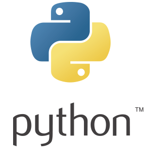

# HackerRank
HackerRank is a place where programmers from all over the world come together to solve problems in a wide range of Computer Science domains such as algorithms, machine learning, or artificial intelligence, as well as to practice different programming paradigms like functional programming.

In this repository, you can find a detailed explanation of my solutions to some of the challenges proposed in this site. Eventhough in [HackerRank](https://www.hackerrank.com/) you can use different languages, such as: C, Java, C#, R, C++, JavaScript, Python, etc., I chose Python 3 to solve all the exercises that you will find here.

  

## Skills
In the next table are listed the skills that I have . 

| Specialized  Skills  | Description  |
|:--------------------:|:---------------:|
| [Artificial-Intelligence](https://github.com/EdinsonLeandro/HackerRank/tree/main/Artificial-Intelligence)      | some wordy text |
| [Mathematics](https://github.com/EdinsonLeandro/HackerRank/tree/main/Mathematics)      | centered        |
| [Project-Euler](https://github.com/EdinsonLeandro/HackerRank/tree/main/Project-Euler) | are neat        |
